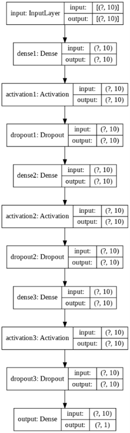
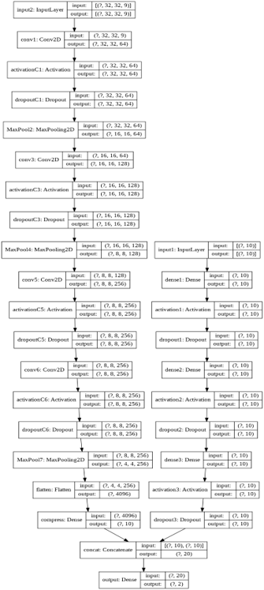

# Detailed Solution

## Contents

1. [Introduction](#introduction)
1. [Summary of Approach](#summary-of-approach)
1. [TP/FP Classifier](#tp-fp-classifier)
1. [Severity Analysis and Resource Allocation](#severity-analysis-and-resource-allocation)
1. [Can we get enough data to train the network reliably?](#can-we-get-enough-data-to-train-the-network-reliably)
1. [Why the extra cost of IoT alarms is worth it](#why-the-extra-cost-of-iot-alarms-is-worth-it)
1. [Conclusion](#conclusion)

## Introduction

Since 2018, smoke detectors have become mandatory in all residences. Given the inability of most smoke detectors to distinguish between smoke from real fires and smoke from innocuous sources, safeguards must be put in place to reduce false alarms. False alarms not only erode public trust in fire safety systems, but also cause precious resources to be wasted on non-existent threats.  

In order for fire alarms to be effective, people need to be able to trust what they hear. As long as people believe fire alarm system to be reliable, they will react to alarms with urgency and execute fire emergency protocols with haste.  

In view of this, we propose using IoT in conjunction with artificial intelligence to improve fire alarm reliability.  

## Summary of Approach

Internet-of-Things (IoT) fire alarms can be gradually introduced to phase out old fire alarm systems. These IoT fire alarms will include sensors that capture meaningful data, which we detail below. The collected data can then be used to train a neural network model for fire detection. On top of that, if visuals of the site of incident are available, image classification can be employed to detect the presence of a fire more confidently. This can be done using Convolutional Neural Networks (CNN) to extract features from the images obtained by visual feeds.  

In order to prevent our model from making the wrong classification, we propose an N-gram like model to account for changes in the situation with respect to time. An N-gram like model would mean that probability is evaluated repeatedly, hence greatly reducing the possibility of wrong classifications. 

Apart from fire detection, gauging the severity of the fire is crucial as well. As we have finite resources and manpower for firefighting and lifesaving, it is imperative to use the appropriate amount of resources for any given situation. 

We propose the following idea to maximise the efficiency of allocation of resources. With data gathered from IoT sensors and selected environmental factors such as density of human traffic and location, we can use a neural network to help predict the level of threat posed by a fire while also mapping a safe evacuation route to allow victims to escape safely from the incident site. 

All in all, early and accurate detection of real fires play a pivotal role in the optimal deployment of resources and in minimising the potential loss of lives and infrastructure. 

## TP FP Classifier

To construct a True Positive (TP), False Positive (FP) classifier, we will require a set of inputs that can accurately determine whether or not there is a fire. The most intuitive input would be images of the space around activated smoke detectors, such as snapshots of CCTV footage. However, visuals are not available everywhere. A common scenario that comes to mind is smokers in public toilets. If a fire were to start due to this, a model dependent solely on visuals would be ineffective. 

To create a system that can be used anywhere, we consider the possibility of using sensor data as a possible input into our classifier. Example of potential inputs include CO/NOx levels, temperature, smoke density, humidity and infrared or UV spectral data. 

Before moving on to the details of our classifier, we would like to take a moment to explain why a TP/FP classifier is needed. Depending on the type of fire alarm installed, different systems will be vulnerable to different types of false positives. For instance, light-based smoke detectors will not be able to distinguish whether the smoke came from a fire, cigarette or incense, thus triggering indiscriminately under all 3 circumstances, while heat detectors can be triggered by innocuous activities such as cooking. The point of having multiple inputs is so that we can discover what combinations of these inputs can rule out certain harmless situations. This allows us to produce an accuracy probability estimate of whether a given set of inputs corresponds to a real fire. Parameter tuning and feature testing will need to be done to strike a balance between cost of sensors and accuracy of classification. 

In a situation without visuals, we can build a deep neural network to do classification, with a SoftMax layer as the output. In our output, TPs are represented by [1,0] and FPs are represented by [0,1], so the first entry in our output is the probability of being a TP, and the second entry in our output is the probability of being a FP, we then treat the situation as FP if it has a probability of <0.5. 

The model is trained using binary-cross entropy as the loss function, and the specific structure of the model can be specified by an array. The model architecture can be customised as explained in the comments of tpfpclassifier.py. The reason we choose not to fix an architecture is because parameter tuning will need to be done to prevent over-fitting of the model. An example of what our program can generate is shown here:  

If visuals are available, we can use a convolutional neural network to help with classification. In order to use both visual data and sensor data, we create a model with two separate inputs, and concatenate our inputs after dimension reduction. The concatenated layer is then fed into the SoftMax layer. Again, we don’t give a hard and fast architecture, but allow for customization within the program. A sample architecture is shown below:  

In order to accommodate for changes in time, the inputs of our model will automatically update itself with the latest data once every certain interval after a fire-alarm has been triggered. An alternative possibility is to use an N-Gram like model which takes in the data of the last N timestamps. Again, parameter tuning will be necessary to achieve the correct balance between computation complexity and accuracy.  

## Severity Analysis and Resource Allocation 

After a fire has been confirmed, the next step in our model is to evaluate the severity of the situation and to allocate resources accordingly. However, the severity of situation depends very much on the location of the fire. Thus, our evaluation will require feature vectors that give an accurate description of possible environmental factors that may affect the spread of fire. The way we propose to do this is once again via a neural network. The input vectors used will include quantifiable environmental factors such as distance from nearest fire-escape, average human density in the area, time of day, as well as the probability score from our TP/FP classifier and inputs from sensor data. The output vector includes measures of fire damage, for instance, area of spread, number of lives lost, value of property loss, etc.  

The point of using such a classifier is that given enough data, the model will be able to accurately give judgement on how severe the situation is so that appropriate resources can be allocated to attend to the case. The network architecture that we suggest is a simple deep neural network as described in severityanalysis.py. 

In addition to our proposed model, the data from IoT alarms can also be used to predict potential routes and areas to avoid, which can be broadcast to people in cases of an emergency. At present, we do not have a proposed model to make such a prediction, but this is definitely something to look into.  

## Can we get enough data to train the network reliably? 

One possible way of creating our datasets could be through existing reports. If existing reports already contain relevant datasets, such as carbon monoxide (CO) levels, smoke density, humidity and other environmental conditions along with the respective outcome of whether the fire alarm was TP or FP, we will be able to train our models to predict based on environmental conditions whether it is a false alarm.  

Additionally, for cases where it is a TP, if there exists reports whereby an analysis on the severity of the fire and its rate of spreading has been recorded, alongside variables like the location and existence of certain (hazardous) objects in the vicinity, we would be able to use these datasets to train the models to predict the level of threat in real-time. 

However, in the event whereby such data does not exist, our model can still be used, albeit not immediately. If IoT detectors are implemented, SCDF can create a structure to collect the necessary data as aforementioned. Environmental conditions would be collected by the IoT sensors, but we will require SCDF personnel to record whether the fire alarm sound-off was a TP or FP on each occurrence. While the IoT detectors will function as traditional detectors initially, as time progresses and more data has been collected, our system will be able to iteratively improve itself. This enhances its ability to predict the existence of a fire and to rank the fire’s threat level via environmental conditions gathered by the IoT sensors and cameras. Thus, we believe that in the long run, such an IoT system will be effective in providing information that can be used in crisis response.  

## Why the extra cost of IoT alarms is worth it

The installation and operating costs of IoT fire alarms are undoubtedly higher than regular fire alarms. However, the high FP rates of regular alarms reduce people’s faith in the sound-off system. In some cases, operators overseeing the fire alarm control panel might not even bother to send someone to inspect the site. As our TP/FP Classifiers take many metrics into account, we believe it will have a higher accuracy than regular alarms. This ensures that operators take alarms classified as a TP seriously. Moreover, the severity index also enables operators to make better responses to the crisis. 

For fire alarms directly connected to SCDF Operations Centre, our IoT alarms will help the brigade to better manage their limited resources. Should our TP/FP Classifier classify the alarm as a false positive, fewer manpower could be dispatched to the site, thereby conserving resources for actual emergencies. 

Given GovTech’s Smart Nation Sensor Platform initiative, there is a push for more buildings to be embedded with sensors, which include those that monitor air quality and temperature. With access to data from existing sensors, fewer sensors will be required in our IoT alarms, which brings costs down. Additionally, sensors in the IoT alarms can also provide users with useful information regarding air quality and temperature. 

## Conclusion

IoT fire alarm systems have not been implemented nation-wide. Time, money and effort are required to gradually phase out the old fire alarm systems used today.  

On top of that, training deep neural networks via supervised learning requires a large labelled dataset. To build up such a dataset, features from IoT sensors such as CO concentration, temperature and humidity have to be captured and stored over time. Realistically speaking, such a process could take many years before our system is reliable enough to be rolled out. Nonetheless, we believe that our proposed sensors are a good long-term investment as our system becomes more and more robust with time. Furthermore, the data we have collected can be used for more than just detection of fire. With proper analysis, the collected data can be used to identify vulnerabilities in our fire-fighting capabilities, potentially saving many lives in the long run. 
